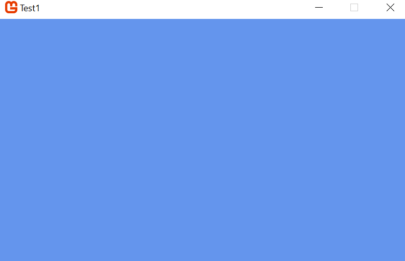

# Game Development

Voor de cursus game development maken we gebruik van het monogame framework.

# Installatie 

> http://www.monogame.net/downloads/

Als je Visual Studio 2017 hebt:
> http://bit.ly/monogamevsdevsetup

# Introductie

MonoGame is een open source implementatie van het Microsoft XNA 4 framework.

Wil je een Android Game maken heb je Android nodig:

- Xamarin.Android: http://android.xamarin.com/ :  ( kan gebruikt worden met Visual Studio of Xamarin Studio)

Het doel van MonoGame is om een framework aan te bieden om xbox, Windows games te maken, maar deze ook te kunnen porten naar Max OS X , linux, iOS, Android platformen. Het motto is: "Write Once, Play everywhere".

De technologie die MonoGame cross-platform maakt zijn:

- OpenTK - een low-level C# library die OpenGL, OpenCL en OpenAL voor 3D graphics wrapt.

- SharpDX - een open-source implementation van de volledige DirectX API voor .NET 

- Lidgren.Network - een networking library voor .NET framework die gebruik maakt van UDP sockets om clients aan een server te binden.

## Project 1



Start Visual studio en selecteer:
> MonoGame Windows Project

> TODO: Verander de achtergrond kleur


### Project 1 - Benodigdheden

De gameloop is je 'driving force' van je spel:


Als we games maken, moeten we beweging simuleren, en deze simulatie implementeren we door gebruik te maken van volgende methoden:

Initialiseren van je elementen:

```
/// <summary>
        /// Allows the game to perform any initialization it needs to before starting to run.
        /// This is where it can query for any required services and load any non-graphic
        /// related content.  Calling base.Initialize will enumerate through any components
        /// and initialize them as well.
        /// </summary>
        protected override void Initialize()
        {
            // TODO: Add your initialization logic here

            base.Initialize();
        }
        
```

Update van je elementen: 

```
 /// <summary>
        /// Allows the game to run logic such as updating the world,
        /// checking for collisions, gathering input, and playing audio.
        /// </summary>
        /// <param name="gameTime">Provides a snapshot of timing values.</param>
        protected override void Update(GameTime gameTime)
        {
            if (GamePad.GetState(PlayerIndex.One).Buttons.Back == ButtonState.Pressed || Keyboard.GetState().IsKeyDown(Keys.Escape))
                Exit();

            // TODO: Add your update logic here

            base.Update(gameTime);
        }

```

Tekenen van je elementen:

```
        /// <summary>
        /// This is called when the game should draw itself.
        /// </summary>
        /// <param name="gameTime">Provides a snapshot of timing values.</param>
        protected override void Draw(GameTime gameTime)
        {
            GraphicsDevice.Clear(Color.CornflowerBlue);

            // TODO: Add your drawing code here

            base.Draw(gameTime);
        }
        
```

De game loop is een simpel architecturaal patroon om je game code te organiseren.

Het hoofddoel van de gameloop is een cyclus te genereren om de status van je game up-te-daten, te tekenen en een zekere tijd te wachten totdat het tijd is om dit over te doen.

We beschouwen 5 fasen:

1. startup
2. update
3. draw
4. wait
5. cleanup.

#### Startup fase

In de startup fase gaan we onze game klaar maken, door bijvoorbeeld alle content in te laden, input devices te initiëren,... Deze fase wordt slechts éénmaal gedaan.

#### Update fase

Dit is het hart van de gameloop, en wordt continu doorlopen. (totdat het spel wordt afgesloten). Normaal wordt de gameloop tussen de 24 en 60 keer per seconde doorlopen.

Het doel is bijvoorbeeld als een object in beweging is zijn coordinaten te updaten zodat bij de volgende loop wat verder bewogen is.

Taken die typisch doorlopen worden in deze fase:

- Polling input devices
- Update van je objecten (update van coordinaten)
- Controle van collisions en eventueel gevolg aan geven
- Uitvoeren van AI voor je vijanden

#### Draw Stage

De rendering van de beelden op het gescherm, afgehandeld door de grafische kaart.

#### Wait Stage

De game loop wordt met regelmatig interval terug doorlopen. De regelmatigheid wordt dus bekomen door een wait stage. Anders krijgen snelle computers meer updates dan tragere, en zal je spel zichtbaar sneller draaien.
Daarom wachten we totdat de interval tijd afgelopen is en een volgende update beginnen. (Denk nu niet dat je dit wachten zal zien, want alles gaat zo snel.. herinner: tussen 24 en 60 keer per seconde!).


#### Game Loop Lag

Bijvoorbeeld je game loop wordt 30 keer per seconde doorlopen. Dit wil zeggen dat elke loop 33.3 milliseconden duurt. Maar wat gebeurt er als je code 40 milliseconden nodig heeft? Je zal terug opnieuw in de loop gaan, maar het zou kunnen dat je deze delays zal opmerken. Het managen van je game performantie is niet simpel! Een typische delay is het instantiëren van nieuwe objecten in de loop: tijdsintensief! Vermijd dit!


#### Cleanup Stage

Bij het afsluiten van de game wordt de gameloop beëindigd, en komen we in de cleanup fase. Hier kunnen we alles wat we niet meer nodig hebben opkuisen. Bijvoorbeeld het disposen van art assets, logging cleanen. Alhoewel je er niet te veel van moet aantrekken, want tussen het .NET framework en XNA wordt dit voor u gedaan.

### XNA's Game Loop

Wat gebeurt er wanneer de loop start:

#### 1. Startup Stage

- constructor van je game
- Initialize method
- LoadContent method
- BeginRun method (not overridden in the template)

#### 2. Update Stage

- Update method

#### 3. Draw Stage

- BeginDraw method (not overridden in the template)
- Draw method
- EndDraw method (not overridden in the template)

#### 4. Wait Stage

Alles gebeurt achter de scene. Geen mogelijkheid om methodes te overriden.

#### 5. Cleanup Stage

- OnExiting method (not overridden in the template)
- EndRun method (not overridden in the template)
- Dispose method (not overridden in the template)
- UnloadContent method

# Project 1 - Tekenen

## Inladen van content

Content zijn de assets die je gebruikt in je game, zoals afbeeldingen, fonts, 3D modellen, muziek, sound effecten..

Wanneer je naar je MonoGame project in de solution explorer kijkt zie je een Content folder. Hierin vind je het Content.mgcb bestand terug, wat alle content van je game definieert.

Dubbel klikken opent de MonoGame Pipeline applicatie (mee geinstalleerd met MonoGame). Wanneer het niet opent, rechtermuisknop > Open With


The MonoGame Pipeline tool wordt gebruikt om je content te managen. De content bestanden worden geprocessed door de pipeline tool en geconverteerd naar .xnb bestanden om te gebruiken in je MonoGame applicatie.

### Wat is een Content Pipeline?

Een content pipeline betekent het proces om een bestand van het ene formaat naar het andere te conveteren. De pipeline tool output het bestand zodat het onmiddellijk kan ingeladen worden door het game project. Deze output bestanden zijn geoptimaliseerd voor "fast loading" en "reduced disk size".

De pipeline tool verwijdert bijvoorbeeld informatie van het bestand dat nuttig is voor de auteur, maar niet nodig tijdens de runtime. Zodat de xnb file het stripped-down versie van het bestand is, wat resulteert in minder disk size.


### XNB File Extension

De .xnb file extensie is de extensie voor alle bestanden die geconverteerd zijn door de pipeline tool.

Dus afbeeldingen (.png), audio files (.wav),of anderen zullen allen ge-output worden als .xnb files.

Extra info: https://developer.xamarin.com/guides/cross-platform/game_development/cocossharp/content_pipeline/walkthrough/


### Tekenen

In de klasse game1.cs maken we een variabele van het type Texture2D aan:

```
private Texture2D myTexture;

```

Daarna maken we de 'myTexture' aan in de LoadContent methode:

```
        protected override void LoadContent()
        {
            // Create a new SpriteBatch, which can be used to draw textures.
            spriteBatch = new SpriteBatch(GraphicsDevice);

            // TODO: use this.Content to load your game content here
            myTexture = Content.Load<Texture2D>("boarMovingRight");
        }
```

Je ziet dat er ook een spriteBatch instantie wordt aangemaakt. Dit kunnen we nu gebruiken om te renderen in de Draw methode:

```

        protected override void Draw(GameTime gameTime)
        {
            GraphicsDevice.Clear(Color.CornflowerBlue);

            // TODO: Add your drawing code here
            spriteBatch.Begin();
            spriteBatch.Draw(myTexture, new Vector2(0,0),Color.Aqua);
            spriteBatch.End();
            base.Draw(gameTime);
        }
        
```
We maken gebruik van onderstaande klassen:

- SpriteBatch: wordt gebruikt om 2D graphics op het scherm te tekenen. Sprites zijn 2D visuele elementen, en de spritebatch object kan een enkele sprite of verschillende tussen de begin en einde methode tekenen.

- Texture2D: stelt een image object voor. Texture2D instanties worden gebruikt voor de rendering met de spritebatch instantie.

- Vector2: stelt de positie in een 2D coordinaten stelsel voor.

- Rectangle: een rechthoek met een positie, breedte en hoogte. Dit wordt gebruikt om te bepalen welk deel van de Texture2D te renderen.


# Oefeningen

1. Implementeer een mechanisme om elke halve seconde een random kleur op het scherm te toveren.

2. Een uitbreiding op vorige oefening. Teken op random plaatsen in je scherm rechthoeken tussen 20 en 300 pixels breedte en hoogte in random verschillende kleuren. (deze rechthoeken mogen op het scherm blijven staan).

> Teken van Rectangles: http://blog.dreasgrech.com/2010/08/drawing-lines-and-rectangles-in-xna.html


---------------------------------------------------------------------
 
# Animatie

Ons voorbeeld toont 3 afbeeldingen van ons karakter. Deze verschillende afbeeldingen in 1 bestand noemen we een "spritesheet". 
Dus van deze spritesheet wordt slechts een bepaald deel getoond op het scherm.

```
spriteBatch.Draw(myTexture, new Vector2(0,0),Color.Aqua);
```

We kunnen de draw methode overriden met nog een vierde argument, namelijk een Rectangle argument waarmee we het deel van de afbeelding selecteren dat we willen laten zien. Onze afbeelding is bijvoorbeeld 252 pixels breed, en 60 pixels hoog, en bestaat uit 3 deelafbeeldingen: Elk deelafbeelding stelt een beweging voor. Als we deze 3 deelafbeeldingen snel genoeg achter elkaar laten zien (zeker minstens 15 keer per seconden), simuleren we echte beweging. Dus het deel van de afbeelding dat we willen laten zien is 252 / 3 = 84 pixels breed. Het volgende frame moeten we dus onze rechthoek opnieuw 84 pixels opschuiven om de volgende deelafbeelding te tonen.

In code betekent dit dus:

```
 Rectangle deelAfbeelding = new Rectangle(0,0,84,60);
 spriteBatch.Draw(myTexture, new Vector2(0,0),deelAfbeelding,Color.Aqua);
```  

Het volgend frame gaan we onze rechthoek 84 pixels opschuiven:

```

    int schuifOp = 0;
        protected override void Draw(GameTime gameTime)
        {
            GraphicsDevice.Clear(Color.CornflowerBlue);

            // TODO: Add your drawing code here
            spriteBatch.Begin();
            Rectangle deelAfbeelding = new Rectangle(schuifOp,0,84,60);
            spriteBatch.Draw(myTexture, new Vector2(0,0),deelAfbeelding,Color.Aqua);
            spriteBatch.End();

            schuifOp += 84;
            if (schuifOp > 168)
                schuifOp = 0;
            base.Draw(gameTime);
        }
```

> Nota: de Rectangle's nul positie is links boven


## Oefening

3. Scene veranderingen zijn factoren waarmee een developer tijdens de implementatie rekening mee moet houden. Tijdens deze oefening zullen we een viewport ontwikkelen:

- Programmeer een "cut"-scene: afbeelding 1 verschijnt op het scherm, en enkele momenten later verschijnt afbeelding 2.

- Programmeer een "wipe"-scene: afbeelding 1 verschijnt op het scherm, later komt afbeelding 2, maar komt van links naar rechts op het scherm, terwijl afbeelding 1 geleidelijk aan verdwijnt: afbeelding 2 duwt afbeelding 1 van het scherm.

4. Teken een rechthoek op het scherm, en laat deze roteren.

# Keyboard Events

Bijna alle games maken gebruik van keyboard events, om bijvoorbeeld een personage rond te bewegen.
Als je Keyboard input wil gebruiken importeer je eerst de juiste library van Xna:

```
using Microsoft.Xna.Framework.Input;
```

Daarna ga je in je update methode checken voor inputs, zoals bijvoorbeeld onderstaande code:

```
public void Update()
        {
            //Check Keyboard state

            KeyboardState stateKey = Keyboard.GetState();

            if (stateKey.IsKeyDown(Keys.Left))
            {
                left = true;
            }

            if (stateKey.IsKeyDown(Keys.Right))
            {
                right = true;
            }

            if (stateKey.IsKeyUp(Keys.Left))
            {
                left = false;
            }

            if (stateKey.IsKeyUp(Keys.Right))
            {
                right = false;
            }

            if (stateKey.IsKeyDown(Keys.Space))
            {
                ChangeState(jumping);
                jump = true;
                startJump = true;
            }

            state.Update();
        }
```

De texture kan gestuurd worden door de pijltjes toetsen. Wanneer de gebruiker een toets indrukt, wordt er een vlag gezet om de status te bewaren (true = pressed, false= not pressed of released). 

Verder wordt in de UPDATE methode gecontroleerd welke toets men ingedrukt, en wordt de positie van de rechthoek verzet: de X en Y offset voor de achtergrond afbeelding wordt maw  bepaald. 


## Animatie

Onze afbeelding is een spritesheet:  onze geanimeerde afbeelding bestaat uit deelafbeeldingen die in 1 bestand zitten. Dus als we op regelmatige tijdstippen een deel van de afbeelding laten zien en deze afwisselen, simuleren we animatie.

De afbeelding is 252px breed, en 60 pixels hoog. De afbeelding bestaat uit 3 deelafbeeldingen, dus elke afbeelding is 252/3 px breed.

De update methode ziet er als volgt uit:

```
    private Rectangle _showRectangle;
    public Hero(Texture2D texture)
    {
       _texture = texture;
       _showRectangle = new Rectangle(0,0, 84,60);
    }
    _showRectangle.X += 84;
    if (_showRectangle.X > 252)
                _showRectangle.X = 0;
            
    spriteBatch.Draw(_texture, new Vector2(0, 0),_showRectangle, Color.Aqua);
            
```

Het probleem dat we tegenkomen is dat de animatie veel te snel gaat. Dus dit moeten we proberen onder controle te houden.

# Frame-independent movement

- Stel ik wil 100 px in 100 frames met een snelheid van 60 FPS bewegen, dan doe ik daar 100frames / 60FPS = 1,66 seconde over.

- stel, ik heb maar 30 FPS beschikbaar op mijn device, dus ga il elke seconde 30 pixels verder, en dus om op positie (100,0) te geraken heb ik dus 100frames/30 FPS = 3,33 seconde voor nodig.

> Conclusie: op device 1 ga ik 2x zo snel.

Dit gedrag heeft invloed op de gebruikservaring. De oplossing om deze ervaring tegen te gaan is frame independent movement.
In plaats van onze figuur (vb. Mario) elk frame een zeker aantal pixels te laten bewegen, gaan we de bewegingssnelheid specifiëren.

Bijvoorbeeld we willen 50 px per seconde bewegen. Nu moeten we ook weten hoeveel tijd verstreken is sinds de laatste beweging. Dit wordt al eens de deltatijd genoemd.

> x += 50 * deltatijd 
    if(x>100)
        x = 0

Als ons spel op 60 FPS draait zal de delta altijd 1/60 of 16,6 milliseconde zijn. Dus in elk frame gaan we 50*0,016 seconde = 0,83 pixels vooruit. Dus po 60FPS = 60*0,83 = 50 pixels!

Als je device dan 30 fps draait, krijg je 50*1/30 = 1,66 pixels vooruit. en dus 1,66 * 30 = 50 pixels.

In mijn praktisch voorbeeld heb ik een spritesheet van 252 pixels, met daarin 3 animaties. Dus elke animatieafbeelding is 84 pixels breed. Om dus 84 pixels per frame op te schuiven:

```
 double x = 0;
        int offset = 0;
       
        public void Update(GameTime gameTime)
        {
           
          
            double temp = 84 * ((double)gameTime.ElapsedGameTime.Milliseconds / 1000);

            x += temp;
            //Als x groter of gelijk aan 84 is laat ik het volgende //deel van de spritesheet zien
            if (x >= 84)
            {
                Console.WriteLine(x);
                x = 0;
                offset += 84;
            }
            if (offset >= 252)
                offset = 0;
 

        }

```

Om 3x sneller te zijn:

```
 double x = 0;
        int offset = 0;
       
        public void Update(GameTime gameTime)
        {
           
          
            double temp = 84 * ((double)gameTime.ElapsedGameTime.Milliseconds / 1000);

            x += temp;
            //Als x groter of gelijk aan 84 is laat ik het volgende //deel van de spritesheet zien
            if (x >= 84/3)  //=> 3x sneller
            {
                Console.WriteLine(x);
                x = 0;
                offset += 84;
            }
            if (offset >= 252)
                offset = 0;
        }
```

We gaan bovenstaande code veralgemen, zodat we frame independent movement in elke spriteklasse kunnen gebruiken

## Generaliseren van frame independent movement

Ik maak een nieuwe klasse AnimationFrame aan:

```
public class AnimationFrame
    {  
            public Rectangle SourceRectangle { get; set; }
                
    }

```


Ik maak een klasse Animation aan (deze klasse bevat 1 of meerdere animationframes):

```

using System;
using System.Collections.Generic;
using System.Linq;
using System.Text;
using System.Threading.Tasks;
using Microsoft.Xna.Framework;

namespace AnimationClass
{
    public class Animation
    {
        private List<AnimationFrame> frames;
        public AnimationFrame CurrentFrame { get; set; }
        public int AantalBewegingenPerSeconde { get; set; }

        private int _totalWidth=0;

        public Animation()
        {
            frames = new List<AnimationFrame>();
            AantalBewegingenPerSeconde = 1;
        }
        public void AddFrame(Rectangle rectangle)
        {
            AnimationFrame newFrame = new AnimationFrame()
            {
                SourceRectangle = rectangle,
                //Duration = duration
            };

            frames.Add(newFrame);
            CurrentFrame = frames[0];
            offset = CurrentFrame.SourceRectangle.Width;
            foreach (AnimationFrame f in frames)
                _totalWidth += f.SourceRectangle.Width;
        }

        private int counter = 0;
        private double x=0;
        public double offset { get; set; }
        public void Update(GameTime gameTime)
        {
            double temp = CurrentFrame.SourceRectangle.Width * ((double)gameTime.ElapsedGameTime.Milliseconds / 1000);

            x += temp;
            if (x >= CurrentFrame.SourceRectangle.Width / AantalBewegingenPerSeconde)
            {
                Console.WriteLine(x);
                x = 0;
                counter++;
                if (counter >= frames.Count)
                    counter = 0;
                CurrentFrame = frames[counter];
                offset += CurrentFrame.SourceRectangle.Width;
            }
            if (offset >= _totalWidth)
                offset = 0;

            
        }
       
    }
}

```

Onze Hero klasse heeft nu (compositie) een animation

```

using System;
using System.Collections.Generic;
using System.IO;
using System.Linq;
using System.Text;
using System.Threading.Tasks;
using Microsoft.Xna.Framework;
using Microsoft.Xna.Framework.Graphics;

namespace AnimationClass
{
    public class Hero
    {
        private Texture2D _texture;

        private Rectangle _showRectangle;

        private Animation _animation;
      
        public Hero(Texture2D texture)
        {
            _animation = new Animation();
            _animation.AddFrame(new Rectangle(0,0,84,60));
            _animation.AddFrame(new Rectangle(84, 0, 84, 60));
            _animation.AddFrame(new Rectangle(168, 0, 84, 60));
            _animation.AantalBewegingenPerSeconde = 5;
            _texture = texture;
            _showRectangle = new Rectangle(0,0, 84,60);
           
         
        }

        double x = 0;
        int offset = 0;
       
        public void Update(GameTime gameTime)
        {
            _animation.Update(gameTime);
        }


        public TimeSpan Duration { get; set; }
        public void Draw(SpriteBatch spriteBatch)
        {
           
            _showRectangle = _animation.CurrentFrame.SourceRectangle;
            spriteBatch.Draw(_texture, new Vector2(0, 0),_showRectangle, Color.Aqua);
           

        }
    }
}


```

# Oefeningen Reeks 2

1. Teken een texture op het scherm en laat deze elke tick 1 pixel in X en Y as opschuiven. Controleer wanneer de cirkel tegen de randen van het scherm botst. Na collision beweegt de texture naar de andere kant.
 
2. Zoek een sprite en laadt hem als texture in. Toon de geanimeerde sprite op het scherm, maar laat je animatie enkel werken wanneer je pijltje links of rechts indrukt.

3. Zoek een sprite voor een linkse en rechtse animatie, en toon op de juiste moment de animatie.

4. Experimenteer zelf met frame independent movement


# Een beetje wiskunde: Vectoren

Getallen kennen we allemaal. Maar met getallen alleen kunnen we geen bewegingen beschrijven, want ze kunnen geen richting weergeven. In de klassieke mechanica worden krachten en bewegingen weergegeven met vectoren.  In de laatste decenia kwam er voor vectorrekenen steeds meer belangstelling door de robotica, visualisering...

## Wat zijn vectoren

Sommige grootheden zijn volledig bepaald als de waarde ervan gegeven is. We noemen dit scalaire grootheden. Een scalair of een getal is een grootheid die beschreven wordt door een grootte eventueel met een eenheid. Een scalair heeft dus een waarde, maar geen richting. Een aantal voorbeelden van scalaire grootheden zijn de temperatuur, vb. 20°C, of de lengte van een persoon, vb. 180 cm.
Het begrip vector komen we vaak tegen bij de beschrijving van grootheden als kracht, snelheid, versnelling,... Deze grootheden hebben behalve een grootte ook een richting en een zin. Vectoren kunnen we dus voorstellen als pijlen in de ruimte.
We kunnen een vector voorstellen met behulp van een pijl waarvan de lengte in verhouding staat tot de grootte.

## Coördinaatvoorstelling

We voorzien de ruimte met een coördinatensysteem, waarmee punten en dus ook vectoren coördinaten krijgen.

In onderstaande figuur is een vlak met oorsprong 0 en 2 punten  a en b getekend. Het punt a heeft hierin coördinaten (Xa,Ya) en punt b (Xb,Yb).

Deze coördinaten kennen we ook toe aan de bijbehorende vectoren en het is daarbij gebruikelijk om ze onder elkaar in een kolom te zetten:
(Xa)
(Ya)

 


Een vector a is een georienteerd lijnstuk, dat éénduidig bepaald wordt door zijn lengte (ook norm of grootte genoemd), richting en zin.
De getallen van de vector noemen we de coördinaten van de vector. De lengte wordt genoteerd als ||a||.

De lengte van de vector kunnen we gemakkelijk uitrekenen met behulp van de stelling van Pythagoras: ||a|| = sqrt(Ax^2 + Ay^2)

Met de monogame library kom je de lengte van een vector te weten door:

```
 var lengteHero = Vector2.Distance(new Vector2(0,0),hero.Position);
 
```

### Optellen van vectoren

De som van 2 vectoren is betekenisvol. Grafisch kunnen we bepalen hoe de som van 2 vectoren verloopt:

> https://nl.wikipedia.org/wiki/Vector_(wiskunde)#Optellen_van_vectoren

De som van vectoren is nuttig in ons gamedesign om de beweging van onze objecten te simuleren.

Bijvoorbeeld ons object staat op positie (10,10), en de snelheid waarmee ons object beweegt is (1,0). Dus we bewegen enkel in de X-Richting.

Om onze volgende positie te weten te komen tellen we deze 2 vectoren op. In monogame mogelijk door vb.

```
Vector2 right = new Vector2(1,0);
Vector2 Position = new vector2(10,10)

Position = Vector2.Add(Position, right);

```
of ook mogelijk door:

```
Position += right;
```

### Vectorcomponenten van een 2D vector

In de tweedimensionale ruimte kunnen we van een vector altijd de x en de y coordinaat bepalen als we de lengte ||a||, en de richting (alfa, met name de hoek tussen de richtingen en de positieve as) van de vector kennen. Uit de rechthoekige driehoek volgt dat:

```
cos alfa = a1/||a|| => a1 = ||a||*cos(alfa)
sin alfa = a2 / ||a|| => a2 = ||a||*sin(alfa)
```

we kunnen dus een 2D vector schrijven als:
a = (||a|| cos(alfa))
    (||a|| sin(alfa))

### Het inwendig product (dot product)

Het inwendig product, kortweg inproduct, is ook gekend als het dotproduct, omdat we deze vermenigvulding noteren met een punt (a dot). Het is het product van 2 vectoren dat als resultaat een getal oplevert.

> Definitie: het product van 2 vectoren, dat als resultaat een getal oplevert, noemen we het inwendig product, of kortweg inproduct.

a.b = a1.b1 + a2.b2+ ... + an.bn

van a = (2,3) en b=(6,-1)
dan is a.b = 2.6 + 3*-1 = 9

Bij het programmeren van animaties moeten we soms de hoek tussen de kijklijn naar 2 objecten kunnen berekenen, bijvoorbeeld de openingshoek van een cameradiafragma om te weten of een persoon in beeld is. Bij vectoren speelt de hoek tussen 2 vectoren vaak een belangrijke rol. De methode om deze grootheid uit te drukken in de coordinaten van de vectoren is het inwendig product.

> https://nl.wikipedia.org/wiki/Inwendig_product

### Oefening

1. Veronderstel dat de camera in een animatie in positie (1,4) staat en vector f (5,3) het camerazicht voorstelt. We weten dat een object zich op de locatie (7,2) bevindt. Als de camera 90° langs beide kanten kan zien, met andere woorden een gezichtsveld van 180° heeft, is het object dan in zicht?

2. Maak een roterende camera (visualiseer dit als een rechthoek). Maak een enemy (vb. een simpel vierkant) aan, en wanneer de roterende camera zich tussen een hoek tussen 0 en 15 graden staat moet de vijand zichtbaar zijn. Experimenteer ook met meerdere vijanden.


## Matrices

Bij programmeren komt het vaak voor dat grootheden als rijen van getallen worden weergegeven, in matrices dus. Bovendien kunnen we elk punt (pixel) op een scherm laten bewegen door gebruik te maken van matrices.

Matrices is een eenvoudig wiskundig begrip. Een matrix is een rechthoek van getallen van de vorm:


waarbij de getallen de elementen van de matrix worden genoemd. De matrix zelf wordt altijd met een hoofdletter aangegeven.

De horizontale lijnen noemen we de rijen van de matrix. De verticale lijnen noemen we de kolommen van de matrix.

Ons bovenstaand voorbeeld toont een 2x3 matrix (heeft dus 2 maal 3 = 6 elementen).

## Som en verschil van matrices

Het optellen van matrices is een belangrijke en eenvoudige bewerking. Willen we twee matrices A en B bij elkaar optellen of van elkaar aftrekken, dan moeten ze dezelfde afmetingen hebben. De som A+B of het verschil A-B is dan een matrix met opnieuw dezelfde afmetingen.

> We bekomen de som van twee matrices door de overeenkomstige matrixelementen op te tellen. Het verschil bekomen we door de overeenkomstige elementen van elkaar af te trekken.

vb.:

A = (-1 5 3)   en B =   (5 3 5)
    ( 4 2 8)            (2 1 9)
    
A+B =   (-1+5 5+3 3+5)  =>  (4 8 8)
        (4+2 2+1 8+9)       (6 3 17)
        
        
A-B =   (-1-5 5-3 3-5)  =>  (-6 2 -2)
        (4-2 2-1 8-9)       (2 1 17)
        
Als A,B matrices zijn van dezelfde afmetingen, dan gelden de volgende eigenschappen:

commutativiteit :  A+B = B+A

## Scalair veelvoud van een matrix

Onder het scalair veelvoud verstaan we het vermenigvuldigen van een matrix met een getal. Deze bewerking kunnen we als volgt definiëren:

> We bekomen het scalair veelvoud van een matrix met een reëel getal λ door alle matrixelementen met λ te vermenigvuldigen.

Voorbeeld:

A = (-1 5 3)   en λ = -2
    ( 4 2 8)
    
    
Dan is λ*A =    -2*   (-1 5 3)    =     (-2*-1 -2*5 -2*3)  =    (2 -10 -6)
                      ( 4 2 8)          (-2*4 -2*2 -2*8)        (-8 -4 -16)
                      
                      
## Vermenigvuldigen van matrices

Twee matrices vermenigvuldigen we door steeds een rij van de eerste matrix met een kolom van de tweede matrix te vermenigvuldigen.

Het getal in de productmatrix dat op de tweede rij in de derde kolom staat is dus de som van de producten van de elementen van de tweede rij van de eerste matrix met de overeenkomstige elementen van de derde kolom van de tweede matrix.

(1 2)   (1 2 3)         (1*1+2*4 1*2+2*5 1*3+2*6)   (9 12 15)
(3 4) . (4 5 6) =       (3*1+4*4 3*2+4*5 3*3+4*6) = (19 26 33)
(5 6)                   (5*1+6*4 5*2+6*5 5*3+6*6)   (29 40 51)


> Om twee matrices te kunnen vermenigvuldigen moet het aantal kolommen van de eerste matrix dus gelijk zijn aan het aantal rijen van de tweede matrix. Het resultaat van de vermenigvuldiging van een 3x2 met een 2x5 matrix is dus een 3x5 matrix.

### Definitie

Twee matrices A en B kunnen, in deze volgorde!, worden vermenigvuldigd als het aantal kolommen van A gelijk is aan het aantal rijen van B. Het aantal rijen van A.B is gelijk aan het aantal rijen van A; het aantal kolommen van A.B is gelijk aan het aantal kolommen van B.

### Eigenschappen

- Het product A.B is meestal niet gelijk aan het product B.A. Het kan zelfs zo zijn dat het ene product bestaat en het andere product niet. Met andere woorden het vermenigvuldigen van matrices is niet commutatief. Het is dus heel belangrijk de juiste volgorde van de matrices te noteren.

- Als de afmetingen van de onderstaande matrices zo zijn dat de volgende vermenigvuldigingen gedefinieerd zijn, dan geldt:

    - associativiteit:          (A.B).C = A.(B.C)
    - rechtse distributiviteit: (A+B).C = A.C + B.C
    - linkse distributiviteit:  C.(A+B) = C.A + C.B
 
## Oefeningen

1. Gegeven:

A = (5 10 0 1)
    (10 200 10 20)
    (20 10 2 1)    

B = (4 10 3 0)
    (10 80 40 50)
    (10 30 2 0)    

- Bereken volgende matrices:
2B-3C


2. Bereken, indien mogelijk, met de matrices:

A = (2 1 3)
    (-1 0 1)

B = (1 -1)
    (0 1)
    (2 3)
    
C = (1 0 -2 1)
    (0 3 1 4)

- A.B
- (A.B).C


## Lineaire transformaties

Het doen bewegen van voorwerpen in computer graphics komt meestal neer op het weergeven van lijnstukken, waarbij die lijnstukken na transformatie terug op lijnstukken worden afgebeeld. Transformaties die dergelijke afbeeldingen, waarbij lijnstukken worden afgebeeld op lijnstukken, beschrijven noemen we lineaire transformaties. Tot deze afbeeldingen behoren de translatie, de schaalverandering, de spiegeling en de rotatie. Deze transformaties kunnen we wiskundig beschrijven door matrices.

Een belangrijke eigenschap van lineaire transformaties is dat we twee opeenvolgende lineaire transformaties kunnen vervangen door één lineaire transformatie, die hetzelfde resultaat geeft. Omgekeerd kan één lineaire transformatie opgesplitst worden in opeenvolgende lineaire transformaties, die na elkaar uitgevoerd hetzelfde resultaat geven.

Transformaties vormen een belangrijk onderdeel van elke 2D en 3D toepassing.

### Translatie

Een beweging naar links,rechts op of neer worden translaties of verschuivingen genoemd. We kunnen de verschuiving van een voorwerp weergeven met een matrixoptelling of een matrixvermenigvuldiging.

#### Voorbeeld van een 2D translatie

We stellen de matrixvergelijking op op tweedimensionele voorwerpen 20 pixels naar rechts en 10 pixels naar beneden te verschuiven op het scherm, en we gebruiken de matrixvergelijking om een rechthoek met hoekpunten (linksboven) (10,10) en (rechtsonder): (20; 16,18) te verschuiven.

(x')    =   (x) + (20)
(y')        (y) + (-10)

Nu moeten we elk oud punt invullen om de nieuwe coördinaten uit te rekenen. Voor punt A krijgen we:
(x')    =   (10) + (20)  =  (30)
(y')        (10)   (-10)    (0)

Voor punt B krijgen we :    (30)
                            (6,18)
         
         
                            
### Translatie met een vermenigvuldiging

Als we ons voorwerp ook willen herschalen en/of roteren dan kunnen we beter een translatie uitvoeren met een vermenigvuldiging. We kunnen in dat geval ook een matrixvergelijking opstellen door aan elke originele locatie een extra component gelijk aan één toe te voegen en te vermenigvuldigen met de translatiematrix. 

Een tweedimensionele translatie wordt met behulp van een matrixvermenigvuldiging als volgt genoteerd:

(x')        (1 0  Δx)       (x)
(y')    =   (0 1  Δy)   .   (y)  
(1)         (0 0   1)       (1)

De 3x3 matrix noemen we de operator die inwerkt op het punt P en als beeld P' geeft. Hierin in  Δx de verplaatsing in de x richting en  Δy de verplaatsing in de y richting.

Merk op dat het oude en het nieuwe punt telkens een extra component 1 hebben. Dit is geen fysische component van het punt. Deze extra component is betekenisloos en heeft enkel tot doel de matrixvermenigvuldiging te kunnen uitrekenen.

(x')        (1.x + 0.y  +1.Δx)       (x+Δx)
(y')    =   (0.x + 1.y  +1.Δy)  =    (y+Δy)   
(1)         (0.x + 0.y  + 1.1)       (1)

#### Een voorbeeld

We stellen de matrixvergelijking op op tweedimensionele voorwerpen 20 pixels naar rechts en 10 pixels naar beneden te verschuiven op het scherm, en we gebruiken de matrixvergelijking om een rechthoek met hoekpunten (linksboven) (10,10) en (rechtsonder): (20; 16,18) te verschuiven.

We kunnen de nieuwe coördinaten in één keer berekenen, namelijk via vermenigvuldiging van de translatiematrix met de  matrix met de coordinaten van de punten:

(x')        (1 0  20)       (10 20 )        (30 40)
(y')    =   (0 1  10)   .   (10 16,18 )  =  (0  6,18)
(1)         (0 0   1)       (1 1 )          (1  1)


## 2D camera in Monogame

´´´

public class Camera2d
    {
        private readonly Viewport _viewport;
        public Vector2 Position { get; set; }      
       
        public Camera2d(Viewport viewport)
        {
            _viewport = viewport;

            Rotation = 0;
            Zoom = 1;            
            Position = Vector2.Zero;
        }      

        public Matrix GetViewMatrix()
        {
           
            Matrix m =
                Matrix.CreateTranslation(new Vector3(-Position, 0.0f));             

            return m;
        }
    }
    
´´´
In game.cs:

´´´

 Vector2 camPos = new Vector2();
  protected override void Update(GameTime gameTime)
        {
            if (GamePad.GetState(PlayerIndex.One).Buttons.Back == ButtonState.Pressed || Keyboard.GetState().IsKeyDown(Keys.Escape))
                Exit();

            // TODO: Add your update logic here
            KeyboardState stateKey = Keyboard.GetState();

            if (stateKey.IsKeyDown(Keys.F1))
            {
                camPos.X -= 1;
            }
            if (stateKey.IsKeyDown(Keys.F2))
            {
                camPos.X += 1;
            }

            hero.Update(gameTime);
            base.Update(gameTime);
        }
        
        
         protected override void Draw(GameTime gameTime)
        {
            GraphicsDevice.Clear(Color.CornflowerBlue);

            var viewMatrix = camera.GetViewMatrix();
           
            camera.Position = camPos;


            spriteBatch.Begin(transformMatrix: viewMatrix);           
           
            hero.Draw(spriteBatch);
            spriteBatch.End();
            base.Draw(gameTime);
        }


´´´


### Schaalverandering

Het vermenigvuldigen van matrices kan ook gebruikt worden om voorwerpen te herschalen. Net als bij de translatie komt het erop neer elk ankerpunt apart te herschalen om het volledige object te herschalen.

De tweedimensionele schaalverandering wordt weergegeven door de matrixvergelijking

(x')        (Sx 0 0 )   (x)
(y')    =   (0  Sy 0) * (y)
(1 )        (0  0  1)   (1)

Als we willen werken met een uniforme schaalverandering dan moeten de proporties dezelfde zijn, dus Sx = Sy. Als we verschillende waarden invullen voor Sx en Sy, dan hebben we een niet-uniforme schaalverandering.

Hou er bovendien rekening mee dat een schaalverandering tussen -1 en 1 voor Sx en Sy de voorwerpen kleiner maakt en een schaalfactor groter dan 1 of kleiner dan -1 de voorwerpen vergroot. Negatieve waarden spiegelen bovendien de voorwerpen naar een ander kwadrant.

#### Voorbeeld van een 2D uniforme schaalverandering

We stellen de algemene matrixvergelijking op om 2-dimensionele voorwerpen drie keer groter te maken, en we gebruiken de matrixvergelijking dan om een rechthoek met linkerbovenpunt (1,5) en rechtsonderpunt (5,3) te vergroten.

(x')        (3 0 0)   (x)
(y')    =   (0 3 0) * (y)
(1 )        (0 0 1)   (1)


Nu vullen we elk punt (1,5) en (5,3) in om de nieuwe coördinaten uit te rekenen.

We krijgen:
(x')        (3 0 0)   (1 5 0)       (3 15 0)
(y')    =   (0 3 0) * (5 3 0) =>    (15 9 0)
(1 )        (0 0 1)   (0 0 1)       (0 0 1)

Als we de punten uittekenen dan zien we dat de rechthoek 3x groter is dan de oude rechthoek. Maar de rechthoek is ook verschoven, weg van de oorsprong. Dit komt doordat de schalingsmatrix opgesteld is ten opzichte van de oorsprong waardoor het object van de oorsprong wegschuift bij een vergroting. Als we een object verkleinen zal het naar de oorsprong toe bewegen. Als we een voorwerp op dezelfde plaats willen houden bij het herschalen (bijvoorbeeld ten opzichte van zijn eigen centrum) dan zullen we moeten werken met een samengestelde transformatie.

## Rotatie

Rotatie maakt ook gebruik van een matrixvermenigvuldiging.
(https://nl.wikipedia.org/wiki/Rotatiematrix)

#### Goniometrie: somformules

sin(α+β) = sinα.cosβ + cosα.sinβ
cos(α+β) = cosα.cosβ - sinα.sinβ
sin(α-β) = sinα.cosβ - cosα.sinβ
cos(α-β) = cosα.cosβ + sinα.sinβ


### Rotatie in twee dimensies

We laten een punt P met coördinaten (x,y) = (cos α, sin α) roteren over heen hoek β en vinden zo het punt punt P' met coördinaten:

(x',y') = (cos(α+β), sin(α+β))


cos(α+β) = cosα.cosβ - sinα.sinβ
sin(α+β) = sinα.cosβ + cosα.sinβ

=>

cos(α+β) = x.cosβ - y.sinβ
sin(α+β) = y.cosβ + x.sinβ

=>

x' = x.cosβ - y.sinβ
y' = y.cosβ + x.sinβ

=>

x' = (cosβ -sinβ)   *   (x)
y' = (cosβ sinβ )       (y)

#### De rotatiematrix

(cosβ -sinβ)   
(cosβ sinβ )  

### Voorbeeld van een 2D rotatie

We gaan een rechthoek met punt (1,1) (linksboven) en (5,2) (rechtsonder) 90° laten roteren.

(x')    (cos90 -sin90 0)    (x)
(y') =  (sin90 cos90  0) *  (y)
(1 )    (0       0    1)    (1)

(x')    (0 -1 0)    (1 5 0)         (-1 -2 0)
(y') =  (1 0  0) *  (1 2 0) =>      (1   5 0)
(1 )    (0 0  1)    (0 0 1)         (0   0 1)

Als je de punten uittekent merk je terug dat de rechthoek geroteerd en verschoven is. Ook de rotatiematrix is standaard opgesteld met als middelpunt de oorsprong. Het resultaat is dat voorwerpen  draaien rond de oorsprong. Als we willen dat de voorwerpen roteren rond hun eigen centrum of rond een specifiek punt, dan moeten we de transformaties samenstellen.

## Samenstellingen

We gaan nu de verschillende translaties, herschalings en rotatiematrices samenstellen tot één transformatiematrix. De uitdagingen die we eerder zijn tegengekomen, namelijk herschalen ten opzichte van een bijvoorbeeld het centrum van de figuur zelf, roteren ten opzichte van een willekeurig punt zullen we nu kunnen aanpakken.

We weten dat het vermenigvuldigen van matrices niet commutatief is. Als we de volgorde, waarin matrices worden vermenigvuldigd, wijzigen krijgen we in de meeste gevallen een ander resultaat. Dit merken we ook in het volgend voorbeeld waarbij we een translatie van 20 pixels omhoog en 10 pixels naar rechts, en een spiegeling ten opzichte van de oorsprong combineren. We passen dit toe op de hoekpunten A(10,10) en B(20; 16,18) van de rechthoek. De eerste keer voeren we eerst de translatie uit, en daarna passen we de spiegeling toe. De tweede maal (rechterkolom) keren we de volgorde om, we voeren eerst de spiegeling uit en daarna verschuiven we de rechthoek:


## Voorbeeld 2D rotatie ten opzichte van een willekeurig punt

We willen een rechthoek met punt (10,10) en (16,18;20) 90° draaien rond het hoekpunt (10,10), dan moeten we dat in volgende stappen doen:

- stap 1: verschuiven naar de oorsprong
- stap 2: 90° roteren
- stap 3: terug verschuiven

Een verschuiving zodat de hoekpunten terug in de oorsprong liggen:
(1 0 -10)
(0 1 -10)
(0 0 1)

Een rotatie over 90°
(cos 90 -sin 90 0)
(sin90 cos 90   0)
(0      0       1)

Terug een translatie:
(1 0 10)
(0 1 10)
(0 0  1)

=> Dit doen we dan als volgt:
(x')    (1 0 10)    (cos 90 -sin 90 0)  (1 0 -10)   (x)
(y') =  (0 1 10) .  (sin90 cos 90   0) .(0 1 -10) . (y)
(1)     (0 0  1)    (0      0       1)  (0 0 1)     (1)

> Zodra we de verschillende stappen van onze transformatie hebben en de volgorde waarin we ze moeten uitvoeren kennen, is de volgende stap het opstellen van de totale transformatiematrix. Let hierbij op dat het vermenigvuldigen van matrices niet commutatief is en dat de volgorde van de matrices dus van groot belang is. We starten met de oude coördinaten uiterst recths en plaatsen er telkens de transformatiematrix voor volgens de stappen waarin ze doorlopen worden.


## Lineaire transformaties

1. Stel de 2D transformatiematrix op om een object over PI/4 radialen te roteren in tegenwijzersin, rond het punt met coördinaten (3,1). Gebruik deze transformatiematrix om de driehoek ABC met hoekpunten A(6,1) B(8,2) en C(7,3) te roteren.


## Camera 2D - 2

 public Matrix GetViewMatrix()
        {
           
            Matrix m =
                Matrix.CreateTranslation(new Vector3(-Position, 0))*
                 Matrix.CreateRotationZ(Rotation)*
                Matrix.CreateScale(Zoom, Zoom, 1);
            return m;
        }


# Collision Detection
 
In de meeste games is collision detection een essentieel onderdeel. Collision detection wil zeggen dat er gecontroleerd wordt of 2 objecten elkaar raken. Er zijn 2 methode om dergelijks te checken: 
 
- Rectangle Collision Detection  
- Per Pixel Collision Detection 
 
 
 
 ## Strategy Patroon in Hero
 
 ```
 
  public abstract class Bediening
    {
        public bool left { get; set; }
        public bool right { get; set; }
        public abstract void Update();
    }

    public class BedieningPijltjes : Bediening
    {
        public override void Update()
        {
            KeyboardState stateKey = Keyboard.GetState();

            if (stateKey.IsKeyDown(Keys.Left))
            {
                left = true;
            }
            if (stateKey.IsKeyUp(Keys.Left))
            {
                left = false;
            }

            if (stateKey.IsKeyDown(Keys.Right))
            {
                right = true;
            }
            if (stateKey.IsKeyUp(Keys.Right))
            {
                right = false;
            }
        }
    }

    public class BedieningKeyb : Bediening
    {
        public override void Update()
        {
            KeyboardState stateKey = Keyboard.GetState();

            if (stateKey.IsKeyDown(Keys.Q))
            {
                left = true;
            }
            if (stateKey.IsKeyUp(Keys.Q))
            {
                left = false;
            }

            if (stateKey.IsKeyDown(Keys.D))
            {
                right = true;
            }
            if (stateKey.IsKeyUp(Keys.D))
            {
                right = false;
            }
        }
    }
    
    ```
    
    In hero.cs:
    
    ```
     public void Update(GameTime gameTime)
        {
            _bediening.Update();
            ...   
        }
    ```
    
    in game.cs
    
    ```
      protected override void LoadContent()
        {
            // Create a new SpriteBatch, which can be used to draw textures.
            spriteBatch = new SpriteBatch(GraphicsDevice);

            _heroTexture = Content.Load<Texture2D>("WalkLeft");
            _hero = new Hero(_heroTexture, new Vector2(200,200));
            _hero._bediening = new BedieningPijltjes();
            _hero2 = new Hero(_heroTexture, new Vector2(500, 200));
            _hero2._bediening = new BedieningKeyb();


        }
    
    ```
 
 ## Rectangle Collision Detection
 
 Hero.cs : 
 
 ```
  public Rectangle CollisionRectangle;

        public Hero(Texture2D _texture, Vector2 _positie)
        {
            Texture = _texture;
            Positie = _positie;//new Vector2(200, 200);
            _ShowRect = new Rectangle(0, 0, 64, 205);
            CollisionRectangle = new Rectangle((int)Positie.X, (int)Positie.Y, 64, 205);

            _animation = new Animation();
            _animation.AddFrame(new Rectangle(0, 0, 64, 205));
            _animation.AddFrame(new Rectangle(64, 0, 64, 205));
            _animation.AddFrame(new Rectangle(128, 0, 64, 205));
            _animation.AddFrame(new Rectangle(192, 0, 64, 205));
            _animation.AantalBewegingenPerSeconde = 8;
        }
  public void Update(GameTime gameTime)
        {
            _bediening.Update();
           

            if(_bediening.left || _bediening.right)
                _animation.Update(gameTime);

            if (_bediening.left)
                Positie -= VelocityX;
            if (_bediening.right)
                Positie += VelocityX;
           
           
            CollisionRectangle.X = (int)Positie.X;
            CollisionRectangle.Y = (int)Positie.Y;

        }
```

In game.cs controleren we bijvoorbeeld de intersectie:

```

 protected override void Update(GameTime gameTime)
        {
            if (GamePad.GetState(PlayerIndex.One).Buttons.Back == ButtonState.Pressed || Keyboard.GetState().IsKeyDown(Keys.Escape))
                Exit();

            _hero.Update(gameTime);
            _hero2.Update(gameTime);


            if(_hero.CollisionRectangle.Intersects(_hero2.CollisionRectangle))
                System.Console.WriteLine("AAA");

            base.Update(gameTime);
        }
        
```